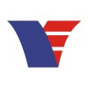
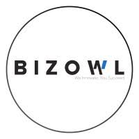
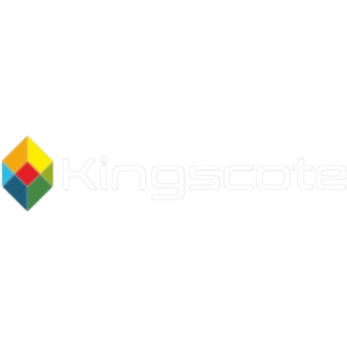
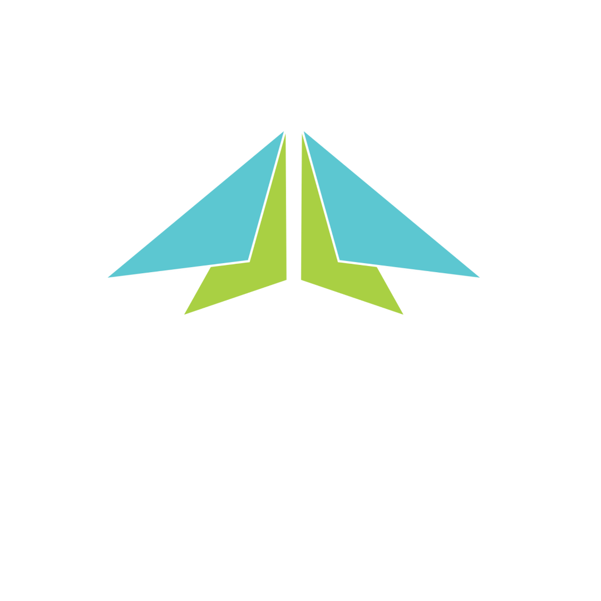

## V-Empower
- *Laravel Developer* | Aug'24 - Present
- 
- Tags: Category 3
- Badges:
  - Full-Stack Developer [blue]
- List Items:
  - I work as a Laravel Developer at V-Empower Inc., focusing on developing cutting-edge web applications. One of my main projects is MyCaly, an appointment and events booking app that serves as a sub-product of our primary video conferencing app, MeetHour.
  - MyCaly streamlines the process of booking events and joining meetings via the MeetHour platform, all within our app itself. Users simply need to connect their MeetHour account and their Google Calendar to MyCaly, and they can enjoy a seamless experience without leaving the app.
  - My role involves leveraging Laravel, Livewire, MySQL, and the MeetHour SDK to build efficient and reliable solutions.
  - I started working in V-Empower from August as as intern, built couple of projects using React.js, Node.js and SQLite and integrated SDK of our Meet Hour App.
  - Then transitioned to Laravel from November and started working on Live-Class Management project. This project included integrating MeetHour, enabling tutors to book and manage classes for their students.
  - Since December, I've been dedicated to the MyCaly project, collaborating with other developers to ensure its success. We've created a seamless experience connecting appointment booking with video conferencing, enhancing user productivity and convenience.

## Bizowl
- *Full-stack Developer* | Sep'23 - Oct'24
- 
- Tags: Category 3
- Badges:
  - Full-Stack Developer [blue]
- List Items:
  - At Bizowl, I was responsible for building dynamic portals catering to our admin, client, and partner needs as well as enhancing the user experience of the main website.
  - These portals aim to streamline and automate critical business processes, enhancing overall efficiency and user experience.
  - My work involves full-stack development, from designing user interfaces to implementing robust back-end functionalities to deploying it on serverless service.
  - Collaborating closely with cross-functional teams, I ensure that our solutions meet the evolving requirements of our stakeholders.
  - This role presents exciting challenges and opportunities for continuous learning, aligning perfectly with my career goals in web development.

## Kingscote Informatics Private Limited
- *Software Developer Trainee* | Jan'24 - May'24
- 
- Tags: Category 3
- Badges:
  - Software Developer Trainee [pink]
- List Items:
  - Built Logistics management and tracking application for a client.
  - Collaborating with cross-functional teams to develop and implement robust solutions.
  - Customizing and extending existing software to meet specific organizational needs.
  - Troubleshooting issues, debugging code, and optimizing performance.
  - Continuously learning and adapting to emerging technologies.

<!-- ## Newtonize (Startup Incubatee) - EdVenture Park
- *Co-founder* | Dec'21 - Apr'22
- 
- Tags: Category 3
- Badges:
  - Entrepreneurship [yellow]
- List Items:
  - During my time as an incubatee at EdVenture Park, I embarked on a dynamic entrepreneurial journey with my startup, Newtonize.
  - Although the startup didn't officially launch, the experience was invaluable in shaping my skills and work ethic.
  - I collaborated with my partner to develop a metaverse using Unreal Engine, striving to create an engaging learning platform for kids.
  - This endeavor required innovative thinking, problem-solving, and determination as we navigated the challenges of startup development.
  - Despite the winding up of the project, the experience honed my abilities in project management, teamwork, and technology integration, strengthening my foundation as I pursue a career in web development. -->